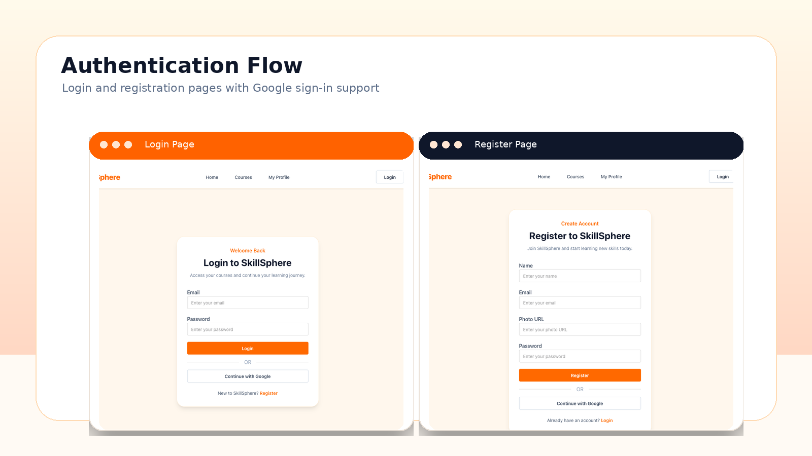

# SkillSphere - Online Learning Platform

## Purpose

SkillSphere is a modern online learning platform where users can explore skill-based courses, view course details, and manage their learning profile. The platform is designed for students who want to learn topics such as web development, UI/UX design, digital marketing, data science, business communication, and cybersecurity.
## Project Screenshots

### Home and Courses Overview


### Authentication Flow


### Protected User Experience


## Live URL

https://skillphere-project.vercel.app

## Key Features

- Responsive navbar with active route highlighting
- Home page with hero section and animated promo strip
- Popular Courses section showing the top 3 highest-rated courses
- Trending Courses section
- Learning Tips section with study and time management tips
- Top Instructors section
- All Courses page with all course cards
- Search functionality by course title
- Protected Course Details page
- Course curriculum section on details page
- User registration with email and password
- User login with email and password
- Google social login
- Logout functionality
- My Profile page for logged-in users
- Update profile information with name and image URL
- Toast notifications for authentication actions
- Loader while fetching data
- Custom not-found page
- Fully responsive design for mobile, tablet, and desktop
- Clean Next.js App Router structure
- No route crash on reload after deployment

## Technologies Used

- Next.js
- React
- Tailwind CSS
- DaisyUI
- BetterAuth
- MongoDB
- Vercel

## NPM Packages Used

- `better-auth`
- `mongodb`
- `react-icons`
- `react-toastify`
- `motion`
- `daisyui`

## Main Routes

```txt
/
Home page

/courses
All courses page

/courses/[id]
Protected course details page

/login
Login page

/register
Register page

/my-profile
Protected profile page

/my-profile/update
Protected update profile page